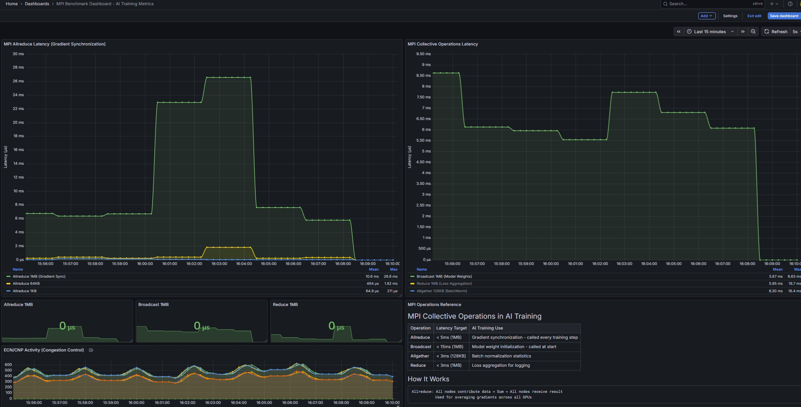

# MPI AI Cluster Benchmark

Production-grade MPI benchmark suite for RDMA-enabled AI training clusters. Simulate real distributed AI training traffic patterns and measure collective operation latencies.



## Overview

This toolkit provides:
- **MPI Collective Benchmarks** - Measure Allreduce, Broadcast, Alltoall, Reduce, Allgather latencies
- **Bandwidth Stress Testing** - Saturate RDMA links with continuous MPI traffic
- **Prometheus Metrics** - Export MPI latencies for monitoring
- **Grafana Dashboard** - Visualize performance and correlate with network congestion (ECN/PFC)

## Why MPI Benchmarks for AI?

Distributed AI training relies heavily on MPI collective operations:

| Operation | AI Training Use | Frequency |
|-----------|----------------|-----------|
| **Allreduce** | Gradient synchronization across GPUs | Every training step |
| **Broadcast** | Model weight distribution | Initialization |
| **Alltoall** | Expert routing in MoE models | Per-layer in MoE |
| **Allgather** | Batch normalization statistics | Per BatchNorm layer |
| **Reduce** | Loss aggregation for logging | Every N steps |

**Allreduce is the critical path** - it's called every training step and directly impacts training throughput.

## Performance Results

### Test Environment
- **Cluster**: 8-node RDMA cluster
- **Network**: 25Gbps RoCEv2 with PFC/ECN enabled
- **Interconnect**: Cisco Nexus switches
- **Transport**: UCX with UD verbs

### Measured Latencies (8 nodes)

| Operation | Message Size | Latency | Target |
|-----------|-------------|---------|--------|
| Allreduce | 4MB | 38.9 ms | < 50ms |
| Allreduce | 1MB | 10.6 ms | < 15ms |
| Allreduce | 64KB | 484 μs | < 1ms |
| Allreduce | 1KB | 64.9 μs | < 100μs |
| Broadcast | 4MB | 25.4 ms | < 30ms |
| Broadcast | 1MB | 5.87 ms | < 10ms |
| Alltoall | 1MB | 73.0 ms | < 100ms |
| Reduce | 1MB | 5.85 ms | < 10ms |
| Allgather | 128KB | 6.30 ms | < 10ms |

### Traffic Generation
- **Stress Test**: Generates ~32MB+ per Allreduce operation (8 nodes × 4MB)
- **Alltoall 1MB**: Generates ~64MB total traffic (each node sends to every other)
- **Link Utilization**: Achieved multi-Gbps sustained throughput

### Congestion Control
ECN (Explicit Congestion Notification) activity observed during stress tests:
- ECN marked packets: 200-600 per second
- PFC frames triggered on switch fabric
- Demonstrates lossless RDMA operation under load

## Quick Start

### Prerequisites
- 2+ Linux servers with RDMA NICs (Mellanox/NVIDIA ConnectX recommended)
- OpenMPI 4.x with UCX support
- Python 3.6+
- OSU Micro-Benchmarks
- Prometheus & Grafana (for monitoring)

### Installation

```bash
# Clone repository
git clone https://github.com/YOUR_USERNAME/mpi-ai-cluster-benchmark.git
cd mpi-ai-cluster-benchmark

# Run setup on all nodes
./scripts/setup_mpi_cluster.sh
```

### Run Benchmarks

```bash
# Quick latency test (single run)
./mpi_test_controller.py once

# Continuous monitoring mode
./mpi_test_controller.py start

# High-bandwidth stress test (saturates links)
./mpi_bandwidth_stress.py start

# Check status
./mpi_bandwidth_stress.py status

# Stop tests
./mpi_bandwidth_stress.py stop
```

### View Metrics

```bash
# Raw metrics
curl http://YOUR_MASTER_IP:9105/metrics

# Import Grafana dashboard
# Use: grafana/mpi_dashboard.json
```

## Architecture

```
┌─────────────────────────────────────────────────────────────┐
│                    Control Node (Your PC)                    │
│  ┌─────────────────┐  ┌─────────────────┐                   │
│  │ mpi_bandwidth_  │  │ mpi_test_       │                   │
│  │ stress.py       │  │ controller.py   │                   │
│  └────────┬────────┘  └────────┬────────┘                   │
└───────────┼────────────────────┼────────────────────────────┘
            │ SSH                │ SSH
            ▼                    ▼
┌─────────────────────────────────────────────────────────────┐
│                    Master Node (Server 1)                    │
│  ┌─────────────────┐  ┌─────────────────┐                   │
│  │ mpi_benchmark_  │  │ Prometheus      │                   │
│  │ exporter.py     │  │ :9090           │                   │
│  │ :9105           │  └────────┬────────┘                   │
│  └────────┬────────┘           │                            │
│           │ mpirun             │                            │
│           ▼                    ▼                            │
│  ┌─────────────────────────────────────────────┐            │
│  │              MPI Cluster (8 nodes)           │            │
│  │  ┌─────┐ ┌─────┐ ┌─────┐ ┌─────┐           │            │
│  │  │Node1│ │Node2│ │Node3│ │Node4│  ...      │            │
│  │  └──┬──┘ └──┬──┘ └──┬──┘ └──┬──┘           │            │
│  │     │       │       │       │               │            │
│  │     └───────┴───────┴───────┘               │            │
│  │              RDMA Fabric                     │            │
│  │         (RoCEv2 + PFC + ECN)                │            │
│  └─────────────────────────────────────────────┘            │
└─────────────────────────────────────────────────────────────┘
            │
            ▼
┌─────────────────────────────────────────────────────────────┐
│                       Grafana                                │
│  ┌─────────────────────────────────────────────┐            │
│  │     MPI Benchmark Dashboard                  │            │
│  │  ┌──────────┐ ┌──────────┐ ┌──────────┐    │            │
│  │  │Allreduce │ │Broadcast │ │ ECN/PFC  │    │            │
│  │  │ Latency  │ │ Latency  │ │ Activity │    │            │
│  │  └──────────┘ └──────────┘ └──────────┘    │            │
│  └─────────────────────────────────────────────┘            │
└─────────────────────────────────────────────────────────────┘
```

## Repository Structure

```
mpi-ai-cluster-benchmark/
├── README.md
├── mpi_bandwidth_stress.py      # High-bandwidth stress test
├── mpi_test_controller.py       # Benchmark controller
├── mpi_benchmark_exporter.py    # Prometheus metrics exporter
├── scripts/
│   ├── setup_mpi_cluster.sh     # Cluster setup script
│   └── deploy_exporter.sh       # Deploy exporter to master
├── grafana/
│   └── mpi_dashboard.json       # Grafana dashboard
├── docs/
│   ├── SETUP.md                 # Detailed setup guide
│   ├── METRICS.md               # Metrics explanation
│   ├── TROUBLESHOOTING.md       # Common issues
│   └── images/
│       └── mpi_grafana.jpg      # Dashboard screenshot
└── config/
    └── hostfile_rdma.example    # Example MPI hostfile
```

## Prometheus Metrics

The exporter exposes these metrics on port 9105:

```prometheus
# Allreduce latency (gradient synchronization)
mpi_allreduce_latency_us{size="4MB",nodes="8"} 38943.86
mpi_allreduce_latency_us{size="1MB",nodes="8"} 10600.0
mpi_allreduce_latency_us{size="64KB",nodes="8"} 484.0
mpi_allreduce_latency_us{size="1KB",nodes="8"} 64.9

# Broadcast latency (model distribution)
mpi_broadcast_latency_us{size="4MB",nodes="8"} 25426.83
mpi_broadcast_latency_us{size="1MB",nodes="8"} 5870.0

# Alltoall latency (MoE routing)
mpi_alltoall_latency_us{size="1MB",nodes="8"} 73033.30

# Other collectives
mpi_allgather_latency_us{size="128KB",nodes="8"} 6300.0
mpi_reduce_latency_us{size="1MB",nodes="8"} 5850.0

# Exporter status
mpi_benchmark_success 1
mpi_benchmark_running 0
mpi_benchmark_last_run_timestamp 1736286417
```

## Understanding the Results

### Latency Scaling

MPI collective latencies scale with:
1. **Message size** - Larger messages = higher latency (bandwidth-bound)
2. **Node count** - More nodes = more communication rounds
3. **Network congestion** - ECN/PFC activation increases latency

### What Good Looks Like

For an 8-node 25Gbps RDMA cluster:

| Metric | Good | Warning | Critical |
|--------|------|---------|----------|
| Allreduce 1MB | < 10ms | 10-20ms | > 20ms |
| Allreduce 4MB | < 40ms | 40-60ms | > 60ms |
| Broadcast 1MB | < 10ms | 10-15ms | > 15ms |
| ECN rate | < 100/s | 100-500/s | > 500/s |

### Interpreting ECN Activity

- **Low ECN (< 100/s)**: Network not congested, optimal performance
- **Medium ECN (100-500/s)**: Some congestion, PFC preventing drops
- **High ECN (> 500/s)**: Heavy congestion, consider traffic shaping

## Configuration

### MPI Hostfile

Create `/home/versa/hostfile_rdma` with RDMA IPs (not management IPs):

```
192.168.251.111 slots=1
192.168.250.112 slots=1
192.168.251.113 slots=1
192.168.250.114 slots=1
192.168.250.115 slots=1
192.168.251.116 slots=1
192.168.250.117 slots=1
192.168.251.118 slots=1
```

### UCX Transport Settings

The benchmarks use these UCX settings for optimal RDMA performance:

```bash
export UCX_TLS=ud_verbs,self,sm    # Use UD transport (more stable)
export UCX_NET_DEVICES=all          # Use all RDMA devices
```

## Comparison with Synthetic RDMA Tests

| Test Type | Purpose | Traffic Pattern | Use Case |
|-----------|---------|-----------------|----------|
| `ib_send_bw` | Raw RDMA bandwidth | Point-to-point flood | NIC testing |
| `ib_write_lat` | Raw RDMA latency | Single message | Network tuning |
| **MPI Collectives** | AI training simulation | Multi-node patterns | Production validation |

MPI collectives better represent real AI training because they involve **coordination across all nodes**, not just point-to-point transfers.

## Contributing

Contributions welcome! Please see [CONTRIBUTING.md](CONTRIBUTING.md) for guidelines.

## License

MIT License - see [LICENSE](LICENSE) for details.

## Acknowledgments

- [OSU Micro-Benchmarks](https://mvapich.cse.ohio-state.edu/benchmarks/) - MPI benchmark suite
- [OpenMPI](https://www.open-mpi.org/) - MPI implementation
- [UCX](https://openucx.org/) - Communication framework

## Related Projects

- [NCCL Tests](https://github.com/NVIDIA/nccl-tests) - NVIDIA Collective Communication Library tests
- [DeepSpeed](https://github.com/microsoft/DeepSpeed) - Microsoft's distributed training library
- [Horovod](https://github.com/horovod/horovod) - Distributed training framework
